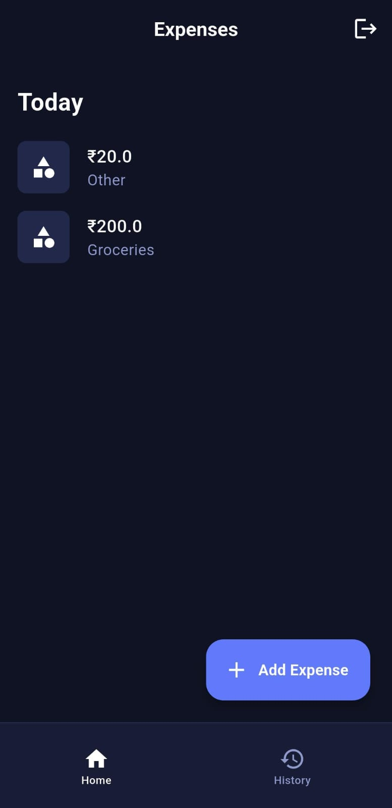
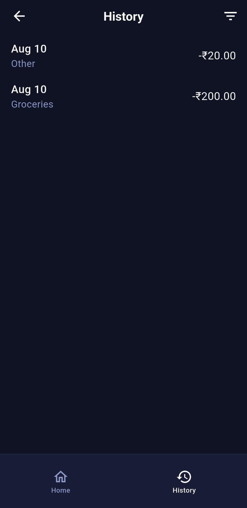
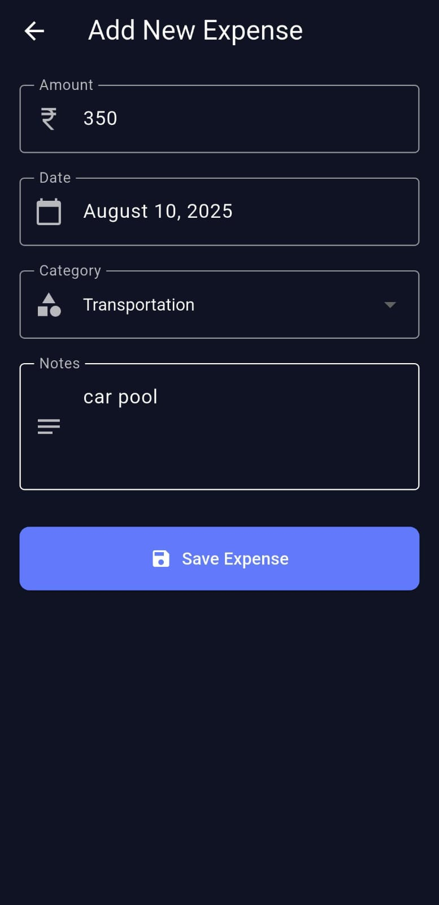

## FinBro - Personal Finance Manager 💰

FinBro is a mobile application designed to help users track their personal expenses effortlessly. The app allows for manual entry of expenses, provides a detailed transaction history with filtering capabilities, and securely manages user data through a custom backend.

## 📸 Screenshots

A glimpse of the FinBro user interface.

| Today Expenses | Expense History | Add Expense |
| :---: | :---: | :---: |
|  |  |  |

### 🎯 Objective

The primary goal of Finbro is to provide a simple, secure, and intuitive platform for personal finance management. The app aims to empower users by giving them a clear overview of their spending habits, with features such as:

* **Automatic Account Creation**: New users are automatically registered upon their first login attempt with a 10-digit phone number.
* **Expense Tracking**: Users can manually add expenses, specifying the amount, category, date, and notes.
* **Transaction History**: A dedicated history section displays all past expenses with a pull-to-refresh mechanism and filtering by category.
* **Data Persistence**: All user data, including expenses and authentication tokens, are stored securely on a PostgreSQL database and in the app's local storage for a seamless experience.
* **Offline Access**: The application caches transaction history, allowing users to view their past spending even without an internet connection.

### 💻 Project Structure

The project is divided into two main components: a **Flutter frontend** for the mobile application and a **TypeScript backend** for data management and authentication.

#### **Frontend (`lib/`)**

* `main.dart`: The entry point of the application, responsible for checking the user's authentication status and routing to the appropriate screen.
* `modals/`: Contains data models (`expense.dart`) for representing expenses.
* `pages/`: Houses all the app's screens, including `login_page.dart`, `home_page.dart`, and `history_page.dart`.
* `services/`: Manages all API communication and local data caching.
    * `auth_service.dart`: Handles user authentication (login/registration) and secure token storage.
    * `expense_service.dart`: Manages all operations related to expenses (add, delete, and fetch history).
* `widgets/`: Contains reusable UI components like `expense_item.dart` and `history_item.dart`.

#### **Backend (`backend/`)**

* `server.ts`: The main Express server file that defines all API endpoints.
* `authMiddleware.ts`: An Express middleware to validate JWT tokens for protected routes.
* `db.ts`: Manages the connection to the PostgreSQL database using environment variables.
* `test.sh`: A shell script for testing all backend API endpoints.
* `package.json` & `tsconfig.json`: Configuration files for Node.js and TypeScript, ensuring a consistent and robust development environment.

### ⚙️ How It Works

#### **1. Authentication Flow**

Upon launching the app, `main.dart` checks for a stored JWT token.
* **No Token**: The user is directed to `login_page.dart`.
* **Token Exists**: The user is directly routed to `home_page.dart`.

When a user attempts to log in, the `AuthService` sends their phone number and password to the `/api/auth` endpoint. The backend automatically handles:
* **First-Time User**: A new user account is created in the PostgreSQL database.
* **Existing User**: The password is verified.

In both cases, a new JWT is generated and sent to the frontend, where it is securely stored for future API calls.

#### **2. Data Management**

* **`Add Expense`**: The `AddExpensePage` sends expense details to the `/api/expenses` endpoint. The backend uses the JWT to identify the user and store the new expense in the `expenses` table.
* **`Get History`**: The `HistoryPage` calls the `expense_service`'s `getHistory` method. This service first checks a local cache (`shared_preferences`).
    * If cached data is available, it's displayed instantly.
    * If no cache exists or the user performs a **pull-to-refresh**, a request is sent to the `/api/history` endpoint. The fetched data is then displayed and saved to the local cache for future use.
* **`Delete Expense`**: When an expense is deleted, a request is sent to the `/api/expenses/:id` endpoint. The backend deletes the record, and the frontend updates both its displayed list and its local cache.